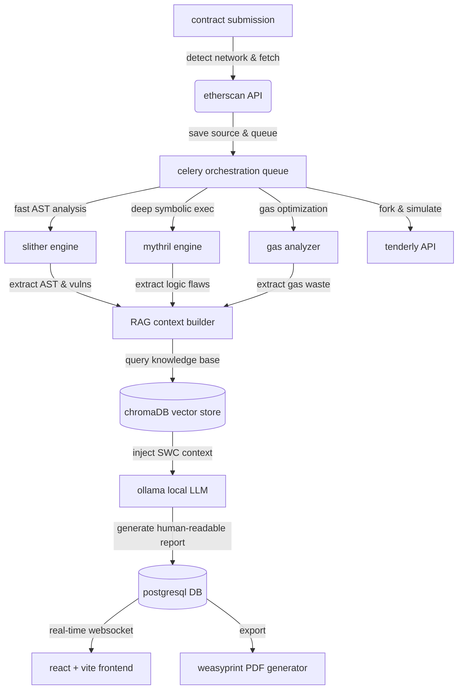

# web3 security scanner: full-stack smart contract observability

web3 security scanner is a production-grade smart contract vulnerability detection and observability platform. it allows engineers, auditors, and def-enthusiasts to register smart contracts across multiple networks (mainnet, polygon, bsc, arbitrum, optimism), explore contract logic under controlled conditions using static and symbolic analysis, generate interactive call graphs, simulate honeypot transactions via tenderly, and continuously monitor for risks using a local LLM-powered RAG pipeline for semantic code understanding.

---

## architecture & system flow



---

## deep dive: pipeline phases

the scanner does not just run a single tool; it orchestrates a massive 8-stage pipeline using celery task chaining. here is exactly what happens when you submit a contract:

### phase 1: source code acquisition
the backend parses the address and connects to the respective block explorer API (etherscan, polyscan, arbiscan, etc). it detects if the contract is a single file, standard JSON, or multi-file architecture. if it is a proxy contract (like EIP-1967 or openzeppelin transparent proxy), the system automatically traverses the storage slots via public RPC nodes to find the actual underlying implementation code.

### phase 2: slither static analysis
the raw solidity code is compiled using `solc-select` to dynamically match the compiler version used on-chain. slither then converts the code into its intermediate representation (slithIR) and generates an abstract syntax tree (AST). this phase catches common issues like reentrancy, uninitialized state variables, and access control flaws in under 5 seconds.

### phase 3: mythril symbolic execution
mythril takes the compiled EVM bytecode and mathematically explores all possible execution paths using an SMT solver (z3). this phase detects deep logical flaws, integer underflows/overflows, and unauthorized self-destructs that static analysis misses.

### phase 4: gas optimization analysis
a secondary slither pass is executed specifically looking for gas bloat. it detects costly loops, un-cached array lengths, division before multiplication (precision loss), and redundant boolean equality checks. each finding is mapped to an estimated "gas saved" metric.

### phase 5: tenderly honeypot simulation
many modern rug-pulls use dynamic taxes or hidden blacklists that only trigger during a sell order. the system connects to the tenderly API, forks the live mainnet state, and simulates a purchase followed immediately by a sell order. if the buy succeeds but the sell reverts, the token is flagged as a highly probable honeypot.

### phase 6: RAG-powered AI review
the raw JSON output from slither and mythril is dense and difficult for junior devs to understand. the system queries a local chromaDB instance (seeded with historical SWC database entries) to find similar past vulnerabilities. it injects this context, along with the raw AST data, into a local LLM running via ollama. the LLM reviews the findings, strips out false positives, and writes a human-readable explanation and remediation plan.

### phase 7: proprietary risk scoring
all findings are aggregated. the system applies a weighted mathematical algorithm to calculate a risk score from 0 to 100.
* critical vulnerabilities carry a 50x multiplier.
* high vulnerabilities carry a 20x multiplier.
* honeypot detection auto-sets the score to 100 (maximum risk).

### phase 8: artifact generation
the final JSON report is saved to postgresql. a websocket event fires to tell the frontend the scan is complete. in the background, weasyprint takes an HTML template and compiles a professional, branded PDF audit report that users can download and share with clients.

---

## key capabilities & architectural tradeoffs

*   **unified analysis engines**: supports combining blazing-fast static analysis (slither) with deep mathematical symbolic execution (mythril).
    *   *tradeoff*: mythril is extremely computationally heavy. to prevent queue blocking, we cap execution timeouts at 120 seconds per function and process it asynchronously alongside slither.
*   **zero-leakage AI semantic review**: utilizes a completely local LLM (ollama with `qwen2.5-coder` or `codellama`) and a local vector database (chromaDB) to explain vulnerabilities.
    *   *tradeoff*: local 1.5b to 7b-parameter models are less capable of complex zero-shot reasoning than GPT-4. to compensate, we inject highly structured RAG context containing verified SWC (smart contract weakness classification) examples. no code is ever sent to OpenAI or Anthropic, ensuring total privacy.
*   **dynamic honeypot simulation**: integrates with tenderly to fork the mainnet state and simulate buy/sell transactions to detect hidden dynamic taxes and honeypots.
    *   *tradeoff*: relies on a centralized SaaS (tenderly API). if tenderly is unreachable, the system gracefully degrades to static ABI heuristic checks (e.g., ensuring a `transfer` or `sell` function exists).
*   **interactive call graph visualization**: automatically parses slither AST data to generate a complete visual map of contract logic.
    *   *tradeoff*: large contracts (like decentralized exchanges) can have thousands of nodes, causing the browser to freeze. we cap the graph at 300 nodes and lazy-load the data only when the user opens the graph tab.
*   **production readiness features**:
    *   *async architecture*: django channels and celery ensure the django API thread is never blocked during 5-minute analysis runs.
    *   *rate limiting*: built-in DRF throttling prevents DoS attacks by limiting authenticated users to 50 scans per hour.
    *   *secure artifact handling*: all subprocesses are protected against path traversal, and sensitive error traces are sanitized.

---

## supported vulnerabilities (SWC registry)

the scanner is configured to detect over 40 specific vulnerability classes. a sample includes:
* **SWC-101**: integer overflow and underflow
* **SWC-104**: unchecked call return value
* **SWC-105**: unprotected ether withdrawal
* **SWC-106**: unprotected selfdestruct instruction
* **SWC-107**: reentrancy (single-function, cross-function, and cross-contract)
* **SWC-112**: delegatecall to untrusted callee
* **SWC-114**: transaction order dependence
* **SWC-115**: authorization through tx.origin
* **SWC-120**: weak randomness (block.timestamp / block.difficulty)

---

## setup & installation

### 1. prerequisites
ensure you have docker and docker-compose installed. you should have at least 8gb of RAM available for the docker engine to support the local LLM.

### 2. configure environment
copy the example environment file and configure your API keys:
```bash
cp .env.example .env
```
open `.env` and fill in the required fields:
* `ETHERSCAN_API_KEY`: get this for free from etherscan.io
* `TENDERLY_ACCESS_KEY`: optional, used for honeypot simulation
* `DJANGO_SECRET_KEY`: any long random string

### 3. run the platform
start all microservices (django, celery, redis, postgres, ollama, chromadb, frontend) via docker:
```bash
docker-compose up --build -d
```
> ⚠️ **first run**: ollama will automatically pull the LLM image (approx 4gb). this process can take 5 to 10 minutes depending on your internet connection. the AI chat will not function until this download completes.

### 4. seed the RAG knowledge base
ingest the baseline security documents into the vector database. this allows the AI to reference past exploits:
```bash
docker-compose exec backend python manage.py ingest_knowledge --source all
```

the interactive react dashboard will now be available at `http://localhost:3000`.

---

## local development (without docker)

if you wish to contribute to the code, you can run the components directly on your host machine.

### backend
1. navigate to `backend/` and create a virtual environment: `python -m venv venv`
2. activate it: `source venv/bin/activate`
3. install dependencies: `pip install -r requirements.txt`
4. run migrations: `python manage.py migrate`
5. start the API server: `python manage.py runserver`

### celery worker
in a separate terminal (with the virtual environment activated):
```bash
celery -A config worker -l info -Q default,analysis,ai
```

### frontend
1. navigate to `frontend/`
2. install dependencies: `npm install`
3. start the vite dev server: `npm run dev`

---

## testing

the platform includes a massive suite of automated unit and integration tests.
to run the complete suite of security and unit tests for the backend:
```bash
docker-compose exec backend pytest scanner/tests/ accounts/tests/ -v
```

---

## API endpoints reference

the platform exposes a rich REST API that can be consumed by external CI/CD pipelines or custom frontends.

### 1. scan registry & execution
*   `POST /api/scans/create/`
    * payload: `{"address": "0x...", "network": "mainnet"}`
    * description: submit a contract address for a full analysis pipeline run. (requires auth)
*   `GET /api/scans/{id}/`
    * description: poll the real-time status and current results of a scan. returns current progress out of 100.
*   `GET /api/scans/`
    * description: list all historical scans associated with the authenticated user.

### 2. observability & reporting
*   `GET /api/scans/{id}/graph/`
    * description: retrieve the interactive call graph structure. returns an array of nodes and directional edges.
*   `POST /api/scans/{id}/chat/`
    * payload: `{"message": "explain the reentrancy in the withdraw function"}`
    * description: open an interactive chat session with the local LLM about the specific scan report.
*   `GET /api/reports/{id}/`
    * description: retrieve the finalized, aggregated JSON security report.
*   `GET /api/reports/{id}/pdf/`
    * description: dynamically generate and download a stylized PDF of the security audit.

### 3. portfolio monitoring
*   `GET /api/watchlist/`
    * description: retrieve the user's monitored portfolio of contracts.
*   `POST /api/watchlist/`
    * payload: `{"address": "0x...", "network": "mainnet", "label": "my dex router"}`
    * description: add a new contract to the watchlist for rapid rescanning and tracking.

### 4. authentication
*   `POST /api/accounts/register/`
    * payload: `{"username": "dev1", "email": "dev@test.com", "password": "StrongPassword123!"}`
    * description: register a new user account with strict password validation (min 8 chars, not entirely numeric).
*   `POST /api/accounts/login/`
    * description: obtain JWT access and refresh tokens.
*   `POST /api/accounts/token/refresh/`
    * description: refresh an expired access token using the refresh token.
