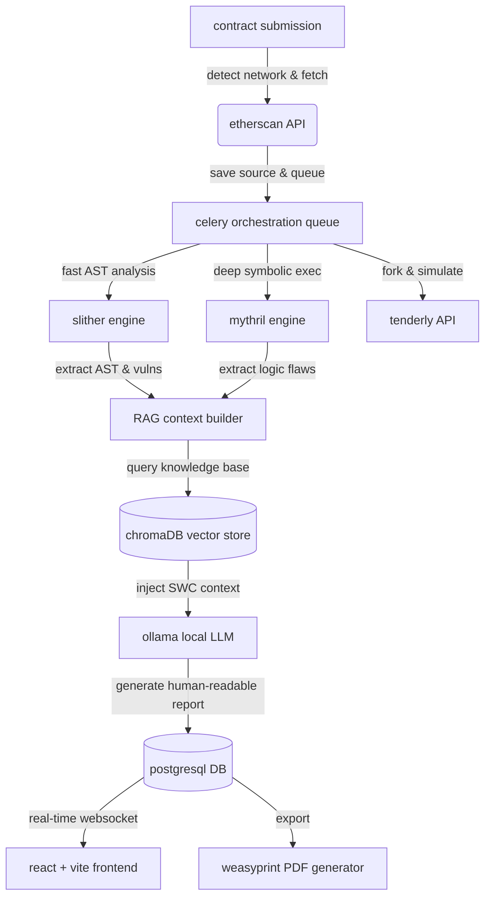

# web3 security scanner: full-stack smart contract observability

[](https://github.com/omkhatri/web3scanner)
web3 security scanner is a production-grade smart contract vulnerability detection and observability platform. it allows engineers and auditors to register smart contracts across multiple networks (mainnet, polygon, bsc), explore contract logic under controlled conditions using static and symbolic analysis, generate call graphs, simulate honeypot transactions via tenderly, and continuously monitor for risks using a local LLM-powered RAG pipeline for semantic code understanding.

---

## architecture & system flow



---

## key capabilities & tradeoffs

*   **unified analysis engines**: supports combining blazing-fast static analysis (slither) with deep mathematical symbolic execution (mythril).
    *   *tradeoff*: mythril is extremely computationally heavy. to prevent queue blocking, we cap execution timeouts at 120 seconds per function and process it asynchronously alongside slither.
*   **zero-leakage AI semantic review**: utilizes a completely local LLM (ollama with `qwen2.5-coder` or `codellama`) and a local vector database (chromaDB) to explain vulnerabilities.
    *   *tradeoff*: local 7b-parameter models are less capable of complex zero-shot reasoning than GPT-4. to compensate, we inject highly structured RAG context containing verified SWC (smart contract weakness classification) examples. no code is ever sent to OpenAI or Anthropic.
*   **dynamic honeypot simulation**: integrates with tenderly to fork the mainnet state and simulate buy/sell transactions to detect hidden dynamic taxes and honeypots.
    *   *tradeoff*: relies on a centralized SaaS (tenderly API). if tenderly is unreachable, the system gracefully degrades to static ABI heuristic checks (e.g., ensuring a `transfer` or `sell` function exists).
*   **interactive call graph visualization**: automatically parses slither AST data to generate a complete visual map of contract logic, highlighting vulnerable execution paths.
*   **production readiness features**:
    *   *async architecture*: django channels and celery ensure the django API thread is never blocked during 5-minute analysis runs.
    *   *rate limiting*: built-in DRF throttling prevents DoS attacks by limiting authenticated users to 50 scans per hour.
    *   *secure artifact handling*: all subprocesses are protected against path traversal, and sensitive error traces are sanitized.

---

## setup & installation

### 1. prerequisites
ensure you have docker and docker-compose installed.

### 2. configure environment
copy the example environment file and configure your API keys:
```bash
cp .env.example .env
# you must add your ETHERSCAN_API_KEY
```

### 3. run the platform
start all microservices (django, celery, redis, postgres, ollama, chromadb, frontend) via docker:
```bash
docker-compose up --build -d
```
> ⚠️ **first run**: ollama will automatically pull the LLM image (~4gb). this takes a few minutes.

### 4. seed the RAG knowledge base
ingest the baseline security documents into the vector database:
```bash
docker-compose exec backend python manage.py ingest_knowledge --source all
```
the interactive react dashboard will now be available at `http://localhost:3000`.

---

## testing

to run the complete suite of automated security and unit tests for the backend:
```bash
docker-compose exec backend pytest scanner/tests/ accounts/tests/ -v
```

---

## API endpoints reference

### 1. scan registry & execution
*   `POST /api/scans/create/` - submit a contract address and network for a full analysis pipeline run. (requires auth)
*   `GET /api/scans/{id}/` - poll the real-time status and current results of a scan.
*   `GET /api/scans/` - list all historical scans associated with the user.

### 2. observability & reporting
*   `GET /api/scans/{id}/graph/` - retrieve the interactive call graph structure for a specific contract.
*   `POST /api/scans/{id}/chat/` - open an interactive chat session with the local LLM about the specific scan report.
*   `GET /api/reports/{id}/` - retrieve the finalized, aggregated JSON security report.
*   `GET /api/reports/{id}/pdf/` - dynamically generate and download a stylized PDF of the security audit.

### 3. portfolio monitoring
*   `GET /api/watchlist/` - retrieve the user's monitored portfolio.
*   `POST /api/watchlist/` - add a new contract to the watchlist for rapid rescanning and tracking.

### 4. authentication
*   `POST /api/accounts/register/` - register a new user account with strict password validation.
*   `POST /api/accounts/login/` - obtain JWT access and refresh tokens.
*   `POST /api/accounts/token/refresh/` - refresh an expired access token.
